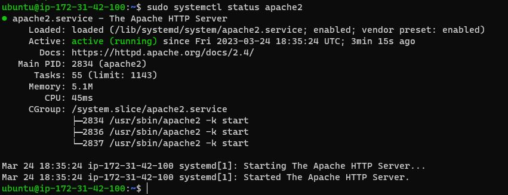

# PROJECT 1: LAMP STACK IMPLEMENTATION
#update a list of packages in package manager

`sudo apt update` 

#run apache2 package installation

`sudo apt install apache2`

#To verify that apache2 is running as a Service in our OS

`sudo systemctl status apache2`

