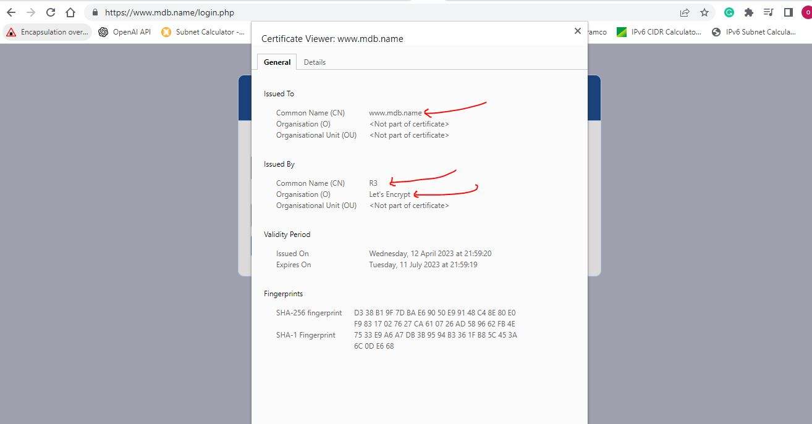

# CONFIGURE NGINX AS A LOAD BALANCER

## Update /etc/hosts file for local DNS with Web Servers’ names

## Configure Nginx LB using Web Servers

## Configure Nginx to recognize reserved name

## Test https

