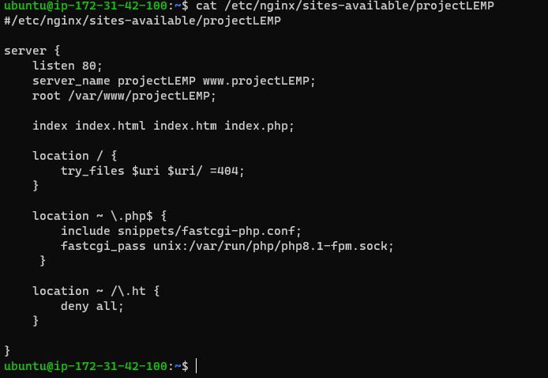

# PROJECT 2: LEMP STACK IMPLEMENTATION

## Step 1 — installing nginx web server 

#update a list of packages in package manager

`sudo apt update` 

#run nginx package installation

`sudo apt install nginx`

#To verify that ngnix is running as a Service in our OS

`sudo systemctl status nginx`

#open webpage from Public internet 

## Step 2 — Installing MYSQL

Same as in Project-1

## Step 3 - Installing PHP for nginx

#run PHP package installation

`sudo apt install php-fpm php-mysql`

## STEP 4 — CONFIGURING NGINX TO USE PHP PROCESSOR

#Create the directory for a new procaject called Projectlemp

`sudo mkdir /var/www/projectlemp`

#Assign ownership of the directory to current system user

`sudo chown -R $USER:$USER /var/www/projectlemp`

#create and open a new configuration file in Apache’s sites-available directory and paste in the configs

`sudo vi /etc/nginx/sites-available/projectlemp.conf`

#Activate configuration by linking to the config file from Nginx’s sites-enabled directory

`sudo ln -s /etc/nginx/sites-available/projectLEMP /etc/nginx/sites-enabled/`

#Confirm nginx link

sudo nginx -t

#disable default Nginx host and reload nginx

sudo unlink /etc/nginx/sites-enabled/default
sudo systemctl reload nginx

#Create new index.html file

`sudo echo 'Hello LEMP from hostname' $(curl -s http://169.254.169.254/latest/meta-data/public-hostname) 'with public IP' $(curl -s http://169.254.169.254/latest/meta-data/public-ipv4) > /var/www/projectLEMP/index.html`

#confirm lemp url

## STEP 5 — Testing PHP with Nginx

#create info.php file

`sudo nano /var/www/projectLEMP/info.php`

 

#confirm php page

## STEP 6 – RETRIEVING DATA FROM MYSQL DATABASE WITH PHP

#create a database named example_database
`sudo mysql
mysql> CREATE DATABASE `example_database`;`

#can create a new user and grant full privileges on the database

`CREATE USER 'user1'@'%' IDENTIFIED WITH mysql_native_password BY 'PassWord.2';
GRANT ALL ON example_database.* TO 'user1'@'%';`

#test if the new user has the proper permissions by logging in to the MySQL

#create a test table named todo_list

CREATE TABLE example_database.todo_list (
mysql>     item_id INT AUTO_INCREMENT,
mysql>     content VARCHAR(255),
mysql>     PRIMARY KEY(item_id)
mysql> );

#Insert a few rows of content in the test table

`INSERT INTO example_database.todo_list (content) VALUES ("My first important item");`

#create a PHP script in custom web root directory that will connect to MySQL and query for your content

#connect to the database

