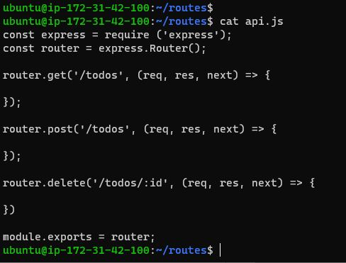
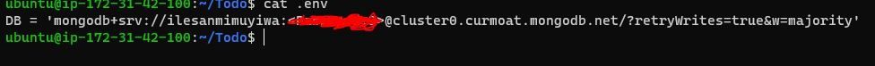
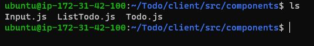

# PROJECT 3: MERN STACK IMPLEMENTATION

## Step 1 — Backend Configuration (Node.js & Express.js)

### Install node.js on server

#Get location of Node.js software from Ubuntun repositories

`curl -fsSL https://deb.nodesource.com/setup_18.x | sudo -E bash -`

`sudo apt-get install -y nodejs`

#verify node and npm installation above

'node -v

npm -v`

###Application Code Setup

#Create a directory for the To-Do for our app

mkdir Todo

#use the command npm init to initialise the project, so that a new file named package.json will be created

`npm init`

#verify json package is created

### Install express.js into our To-Do app directory

#install express.js 

`npm install express`

#create a file index.js

`touch index.js`

#Install the dotenv module

`npm install dotenv`

#Open the index.js file and put in some configs

#start express.js server

`node index.js`

#on aws security group permit tcp 5000 cos our server is running on port 5000

#confirm access to express web

#create route folder > api.js file inside our TODO folder, configure it to perform post, get, delete operation

### Models

#install mongoose which is a Node.js package that makes working with mongodb easier

`npm install mongoose`

#create models directory > todo.js file in out TODO list

`mkdir models && cd models && touch todo.js` > paste configs

#update our routes from the file api.js in ‘routes’ directory to make use of the new model.

### MongoDB

#create env variable specified in index.js

#update index.js with env
`const express = require('express');
const bodyParser = require('body-parser');
const mongoose = require('mongoose');
const routes = require('./routes/api');
const path = require('path');
require('dotenv').config();

const app = express();

const port = process.env.PORT || 5000;

//connect to the database
mongoose.connect(process.env.DB, { useNewUrlParser: true, useUnifiedTopology: true })
.then(() => console.log(`Database connected successfully`))
.catch(err => console.log(err));

//since mongoose promise is depreciated, we overide it with node's promise
mongoose.Promise = global.Promise;

app.use((req, res, next) => {
res.header("Access-Control-Allow-Origin", "\*");
res.header("Access-Control-Allow-Headers", "Origin, X-Requested-With, Content-Type, Accept");
next();
});

app.use(bodyParser.json());

app.use('/api', routes);

app.use((err, req, res, next) => {
console.log(err);
next();
});

app.listen(port, () => {
console.log(`Server running on port ${port}`)
});`

#test connection to mongodb

#Postman Post

#Postman Get

## Step 2 — Front End creation

#scaffold our app in TODO folder (install react)

`npx create-react-app client`

#This will create a new folder in Todo directory called client, where we will add all the react code.

#Install react dependencies (concurrently (allows to run more than one command simultaneously from the same terminal window.) and nodemon)

`npm install concurrently --save-dev`

`npm install nodemon --save-dev`

#update script for node.js in TODO > package.json file in TODO

#configure proxy in react  in TODO > react > package.json
#thi allows access to the application directly from the browser by simply calling the server url like http://localhost:5000 rather than always including the entire path like http://localhost:5000/api/todos

#enable in TODO directory

`npm run dev`

#permit access to server on port 3000

#Creating React Components in TODO > client > src and create 3 files name (Input.js, ListTodo.js and Todo.js);

#update input.js

`
import React, { Component } from 'react';
import axios from 'axios';

class Input extends Component {

state = {
action: ""
}

addTodo = () => {
const task = {action: this.state.action}

    if(task.action && task.action.length > 0){
      axios.post('/api/todos', task)
        .then(res => {
          if(res.data){
            this.props.getTodos();
            this.setState({action: ""})
          }
        })
        .catch(err => console.log(err))
    }else {
      console.log('input field required')
    }

}

handleChange = (e) => {
this.setState({
action: e.target.value
})
}

render() {
let { action } = this.state;
return (

<input type="text" onChange={this.handleChange} value={action} />
<button onClick={this.addTodo}>add todo</button>

)
}
}

export default Input
`

#Install axios in client directory

`npm install axios`

#Update ListTodo.js code in /home/ubuntu/Todo/client/src/components

`
import React from 'react';

const ListTodo = ({ todos, deleteTodo }) => {

return (
<ul>
{
todos &&
todos.length > 0 ?
(
todos.map(todo => {
return (
<li key={todo._id} onClick={() => deleteTodo(todo._id)}>{todo.action}</li>
)
})
)
:
(
<li>No todo(s) left</li>
)
}
</ul>
)
}

export default ListTodo`

#Update Todo.js code in /home/ubuntu/Todo/client/src/components

`import React, {Component} from 'react';
import axios from 'axios';

import Input from './Input';
import ListTodo from './ListTodo';

class Todo extends Component {

state = {
todos: []
}

componentDidMount(){
this.getTodos();
}

getTodos = () => {
axios.get('/api/todos')
.then(res => {
if(res.data){
this.setState({
todos: res.data
})
}
})
.catch(err => console.log(err))
}

deleteTodo = (id) => {

    axios.delete(`/api/todos/${id}`)
      .then(res => {
        if(res.data){
          this.getTodos()
        }
      })
      .catch(err => console.log(err))

}

render() {
let { todos } = this.state;

    return(
      

        <h1>My Todo(s)</h1>
        <Input getTodos={this.getTodos}/>
        <ListTodo todos={todos} deleteTodo={this.deleteTodo}/>
      

    )

}
}

export default Todo;`

#Create  App.js code in /home/ubuntu/Todo/client/src and upload code

`
import React from 'react';

import Todo from './components/Todo';
import './App.css';

const App = () => {
return (

<Todo />

);
}

export default App;
`

#Create  App.css in /home/ubuntu/Todo/client/src and upload code

`.App {
text-align: center;
font-size: calc(10px + 2vmin);
width: 60%;
margin-left: auto;
margin-right: auto;
}

input {
height: 40px;
width: 50%;
border: none;
border-bottom: 2px #101113 solid;
background: none;
font-size: 1.5rem;
color: #787a80;
}

input:focus {
outline: none;
}

button {
width: 25%;
height: 45px;
border: none;
margin-left: 10px;
font-size: 25px;
background: #101113;
border-radius: 5px;
color: #787a80;
cursor: pointer;
}

button:focus {
outline: none;
}

ul {
list-style: none;
text-align: left;
padding: 15px;
background: #171a1f;
border-radius: 5px;
}

li {
padding: 15px;
font-size: 1.5rem;
margin-bottom: 15px;
background: #282c34;
border-radius: 5px;
overflow-wrap: break-word;
cursor: pointer;
}

@media only screen and (min-width: 300px) {
.App {
width: 80%;
}

input {
width: 100%
}

button {
width: 100%;
margin-top: 15px;
margin-left: 0;
}
}

@media only screen and (min-width: 640px) {
.App {
width: 60%;
}

input {
width: 50%;
}

button {
width: 30%;
margin-left: 10px;
margin-top: 0;
}
}`

#Create  index.css in /home/ubuntu/Todo/client/src and upload code

`body {
margin: 0;
padding: 0;
font-family: -apple-system, BlinkMacSystemFont, "Segoe UI", "Roboto", "Oxygen",
"Ubuntu", "Cantarell", "Fira Sans", "Droid Sans", "Helvetica Neue",
sans-serif;
-webkit-font-smoothing: antialiased;
-moz-osx-font-smoothing: grayscale;
box-sizing: border-box;
background-color: #282c34;
color: #787a80;
}

code {
font-family: source-code-pro, Menlo, Monaco, Consolas, "Courier New",
monospace;
}`

#enable app in the TODO directory

`npm run dev`

#test app

could not test cos of server issue. Server cpu spikes when react is installed