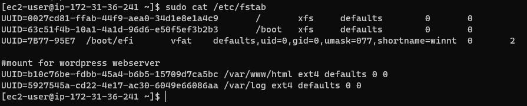

# PROJECT 6: Web Solution With WordPress

## Step 1 — Prepare a Web Server

### "lsblk" command to inspect what block devices are attached to the server  "df -h" command to see all mounts and free space on your server

### Using gdisk utility to create a single partition on each of the 3 disks

### check for available partition

`sudo yum install lvm2`
`sudo lvmdiskscan`

### Use pvcreate utility to mark each of 3 disks as physical volumes (PVs) to be used by LVM
`sudo pvcreate /dev/xvdf1`
`sudo pvcreate /dev/xvdg1`
`sudo pvcreate /dev/xvdh1`

### Use vgcreate utility to add all 3 PVs to a volume group (VG) named webdata-vg

`sudo vgcreate webdata-vg /dev/xvdh1 /dev/xvdg1 /dev/xvdf1`

### Using lvcreate utility to create 2 logical volumes

`sudo lvcreate -n apps-lv -L 14G webdata-vg`
`sudo lvcreate -n logs-lv -L 14G webdata-vg`

### verify setup

`sudo vgdisplay -v #view complete setup - VG, PV, and LV`
`sudo lsblk`

### format the logical volumes with ext4 filesystem

`sudo mkfs -t ext4 /dev/webdata-vg/apps-lv`
`sudo mkfs -t ext4 /dev/webdata-vg/logs-lv`

### Create /var/www/html directory to store website files

`sudo mkdir -p /var/www/html`

### Create /home/recovery/logs to store backup of log data

`sudo mkdir -p /home/recovery/logs`

### Mount /var/www/html on apps-lv logical volume

`sudo mount /dev/webdata-vg/apps-lv /var/www/html/`

### Using rsync utility to backup all the files in the log directory /var/log into /home/recovery/logs (required before mounting)

`sudo rsync -av /var/log/. /home/recovery/logs/`

### Mount /var/log on logs-lv logical volume

`sudo mount /dev/webdata-vg/logs-lv /var/log`

### Restore log files back into /var/log directory

`sudo rsync -av /home/recovery/logs/. /var/log`

### UPDATE THE `/ETC/FSTAB` FILE

`sudo blkid`

### Test the configuration and reload the daemon

`sudo mount -a`
`sudo systemctl daemon-reload`

## Step 2 — Prepare the Database Server

## Step 3 — Install WordPress on your Web Server EC2

### Install wget, Apache and it’s dependencies and Start Apache

`sudo yum -y install wget httpd php php-mysqlnd php-fpm php-json`
`sudo systemctl enable httpd`
`sudo systemctl start httpd`

### install PHP and it’s depemdencies

`sudo yum install https://dl.fedoraproject.org/pub/epel/epel-release-latest-8.noarch.rpm`
`sudo yum install yum-utils http://rpms.remirepo.net/enterprise/remi-release-8.rpm`
`sudo yum module list php`
`sudo yum module reset php`
`sudo yum module enable php:remi-7.4`
`sudo yum install php php-opcache php-gd php-curl php-mysqlnd`
`sudo systemctl start php-fpm`
`sudo systemctl enable php-fpm`
`setsebool -P httpd_execmem 1`

### Restart Apache

`sudo systemctl restart httpd`

### Download wordpress and copy wordpress to var/www/html

`mkdir wordpress`
`cd   wordpress`
`sudo wget http://wordpress.org/latest.tar.gz`
`sudo tar xzvf latest.tar.gz`
`sudo rm -rf latest.tar.gz`
`cp wordpress/wp-config-sample.php wordpress/wp-config.php`
`cp -R wordpress /var/www/html/`

### Configure SELinux Policies

`sudo chown -R apache:apache /var/www/html/wordpress`
`sudo chcon -t httpd_sys_rw_content_t /var/www/html/wordpress -R`
`sudo setsebool -P httpd_can_network_connect=1`

### Install MySQL on your DB Server EC2
`sudo yum update`
`sudo yum install mysql-server`
`sudo systemctl restart mysqld`
`sudo systemctl enable mysqld`

### Configure DB to work with WordPress
`sudo mysql`
`CREATE DATABASE wordpress;`
`CREATE USER 'myuser'@'<Web-Server-Private-IP-Address>' IDENTIFIED BY 'mypass';`
`GRANT ALL ON wordpress.* TO 'myuser'@'<Web-Server-Private-IP-Address>';`
`FLUSH PRIVILEGES;`
`SHOW DATABASES;`
`exit`

### Configure WordPress to connect to remote database

#configure db security group to allow connection to db on tcp port 3306 from webserver

### Install MySQL client and test connectivity from Web Server to  DB server by using mysql-client

`sudo yum install mysql`
`sudo mysql -u myuser -p -h <DB-Server-Private-IP-address>`

### update wordpress/wp-config.php file on webserver with db credentials

### test server

