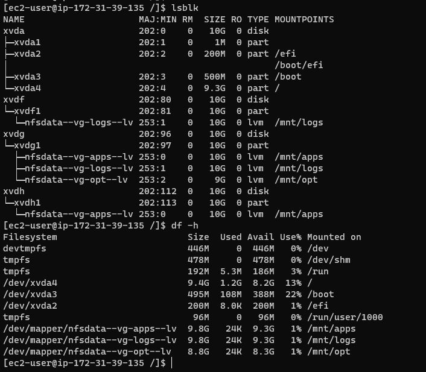

# STEP 1 – PREPARE NFS SERVER

## NFS logical volumes

## Disk mount

## Install NFS server, configure it to start on reboot and make sure it is u and running
`sudo yum -y update`
`sudo yum install nfs-utils -y`
`sudo systemctl start nfs-server.service`
`sudo systemctl enable nfs-server.service`
`sudo systemctl status nfs-server.service`

## Set up permission that will allow Web servers to read, write and execute files on NFS:

`sudo chown -R nobody: /mnt/apps`
`sudo chown -R nobody: /mnt/logs`
`sudo chown -R nobody: /mnt/opt`

`sudo chmod -R 777 /mnt/apps`
`sudo chmod -R 777 /mnt/logs`
`sudo chmod -R 777 /mnt/opt`

`sudo systemctl restart nfs-server.service`

## Configure access to NFS for clients

## Check which port is used by NFS and open it using Security Groups

`rpcinfo -p | grep nfs`

# STEP 2 — CONFIGURE THE DATABASE SERVER

## Install MySQL server

## Create a database and name it tooling
## Create a database user and name it webaccess
## Grant permission to webaccess user on tooling database to do anything only from the webservers subnet cidr

# Step 3 — Prepare the Web Servers

## Install NFS client on all servers

`sudo yum install nfs-utils nfs4-acl-tools -y`

## Mount /var/www/ and /var/log and target the NFS server’s export for apps and logs

`sudo mkdir /var/www`
`sudo mount -t nfs -o rw,nosuid <NFS-Server-Private-IP-Address>:/mnt/apps /var/www`
`sudo mount -t nfs -o rw,nosuid <NFS-Server-Private-IP-Address>:/mnt/logs /var/www`

## Making changes persist on Web Server after reboot

## Installing Remi’s repository, Apache and PHP

`sudo yum install httpd -y`

`sudo dnf install https://dl.fedoraproject.org/pub/epel/epel-release-latest-8.noarch.rpm`

`sudo dnf install dnf-utils http://rpms.remirepo.net/enterprise/remi-release-8.rpm`

`sudo dnf module reset php`

`sudo dnf module enable php:remi-7.4`

`sudo dnf install php php-opcache php-gd php-curl php-mysqlnd`

`sudo systemctl start php-fpm`

`sudo systemctl enable php-fpm`

`sudo setsebool -P httpd_execmem 1`

## Update the website’s configuration to connect to the database (in /var/www/html/functions.php file)

##  Apply tooling-db.sql script to your database using this command 

`mysql -h 172.31.36.156 -u webaccess -p tooling < tooling-db.sql`

## Page confirmation

